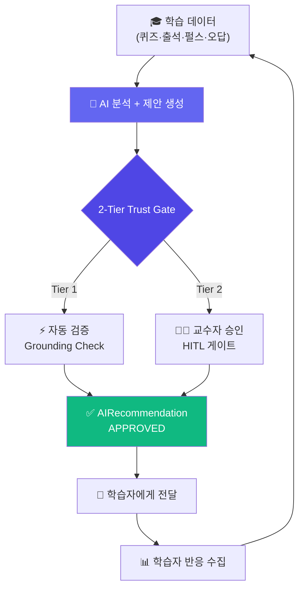
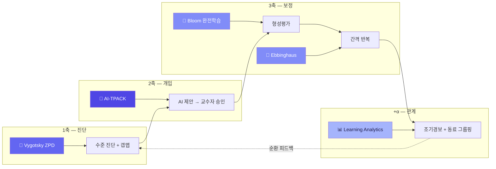

<h1 align="center">
  🔄 RE:Boot
</h1>

<h3 align="center">
  Human-in-the-Loop 적응형 학습 플랫폼
</h3>

<p align="center">
  부트캠프형 SW·AI 교육의 중도포기율 감소와 AI 과의존 방지
</p>

<p align="center">
  
</p>

<p align="center">
  
  
  
  
  
</p>

---

## 📋 학술대회 출품 정보

> **2026 한국교육정보미디어학회 춘계학술대회**
> 
> 📍 연세대학교 · 2026.05.30 (토)
> 
> 🏷️ 출품 부문: **미디어전** (컴퓨터 매체) · AI 기반 교수·학습 혁신
> 
> 🎯 대주제: *"AI 기반 교육의 확장과 신뢰성: 미래 교육의 재설정"*
> 
> 👩‍🎓 **김혜진** · 연세대학교 교육대학원 교육공학 전공

---

## 🔍 해결하는 문제

> 부트캠프 학습자의 **21%가 중도포기**하며, 1인당 최대 **₩2,000만 원**의 국비가 손실됩니다.
> 동시에 AI 교육 도구의 **과의존(Over-reliance)** 문제가 부상하고 있습니다.
>
> RE:Boot는 **AI의 확장성**과 **교수자 판단의 신뢰성**을 결합해 두 문제를 동시에 해결합니다.

---

## 🏛️ 2-Tier Trust 아키텍처



---

## 📚 교육공학 이론 → 기능 매핑



| 이론 | 원저 | RE:Boot 기능 |
| :--- | :--- | :--- |
| Vygotsky 근접발달영역 | Vygotsky (1978) | 수준 진단 + 갭맵 시각화 |
| Bloom 완전학습 | Bloom (1968) | 형성평가 → 오답 자동 복습 등록 |
| Ebbinghaus 망각곡선 | Ebbinghaus (1885) | 10분 / 1일 / 1주 / 1개월 / 6개월 간격 반복 |
| AI-TPACK | Mishra & Koehler (2006) | AI 제안 → 교수자 승인/거부 게이트 |
| Learning Analytics | Siemens (2013) | 조기경보 + 동료 그룹핑 |
| Self-RAG + CRAG | Asai (2024), Yan (2024) | 8단계 Agentic RAG AI 튜터 |

---

## 🎯 핵심 기능 6가지

| # | 기능 | 사용자 | 이론 |
| :---: | :--- | :---: | :--- |
| 1 | 🔍 수준 진단 + 갭맵 | 학습자 | ZPD |
| 2 | 📋 적응형 커리큘럼 + 교수자 승인 | 양쪽 | AI-TPACK |
| 3 | ✏️ 형성평가 + 간격 반복 | 학습자 | Bloom + Ebbinghaus |
| 4 | 💬 Agentic RAG AI 튜터 | 학습자 | Self-RAG + CRAG |
| 5 | 🚨 조기경보 + 동료 그룹핑 | 교수자 | Learning Analytics |
| 6 | ✅ AI 제안 관리 (HITL 게이트) | 교수자 | AI-TPACK |

### 💬 Agentic RAG 튜터 — 8단계 파이프라인


---

## 🔬 학술 기여 (Research Contribution)

| Gap | 기존 한계 | RE:Boot 해결 |
| :---: | :--- | :--- |
| 1 | AI 교육 플랫폼이 단일 이론 기반 | 5개 교육학 이론 통합 구현 |
| 2 | 이탈 예측만 하고 개입 미연결 | 감지→제안→승인→전달 E2E 파이프라인 |
| 3 | AI-교수자 협업 이론만, 구현체 없음 | AIRecommendation 워크플로우 실구현 |
| 4 | AI 신뢰성 확보가 이론에 머무름 | 2-Tier Trust + Grounding + Reflection |

### 🌍 2025 해외 탑 저널 트렌드 정합

| 학회 | 키워드 | RE:Boot |
| :--- | :--- | :--- |
| EDM 2025 Best Paper | Trust but Over-reliance | 2-Tier Trust |
| CHI 2025 Best Paper | Co-Adaptive Teaching | 교수자 피드백 순환 |
| AIED 2025 | Teacher-Driven Evaluation | 교수자 주도 검증 |
| LAK 2025 Best Paper | Retention Prediction | EWS + 동료 그룹핑 |

---

## 🛠️ 기술 스택

| 레이어 | 기술 |
| :--- | :--- |
| Backend | FastAPI · SQLAlchemy 2 (async) · Pydantic v2 |
| Frontend | Next.js 15 · React 19 · Tailwind · shadcn/ui · Vercel AI SDK |
| Database | PostgreSQL 16 · pgvector (768d) |
| LLM | Gemini 2.5 Flash · gemini-embedding-001 |
| Infra | Docker Compose · GCP Cloud Run |

<details>
<summary>📁 디렉토리 구조</summary>

```
RE-Boot/
├── api/                        # FastAPI 백엔드
│   ├── app/
│   │   ├── models/             # 15 ORM 모델
│   │   ├── routers/            # 6 도메인, 19+ API
│   │   ├── services/
│   │   │   ├── tutor/          # Agentic RAG (10 서비스 + 10 프롬프트)
│   │   │   ├── adapt/          # 2-Tier Trust 게이트
│   │   │   ├── mastery/        # SM-2 간격 반복
│   │   │   └── analytics/      # 조기경보 + peer grouping
│   │   └── core/               # JWT, Gemini wrapper
│   └── Dockerfile
├── web/                        # Next.js 15
│   ├── src/app/                # 7 페이지
│   └── Dockerfile
├── docs/                       # 설계 문서 5종
├── scripts/                    # 기동/배포/시드
├── docker-compose.yml
└── cloudbuild.yaml
```

</details>

---

## 📖 참고문헌

1. 박진아, 김지은 (2024). 부트캠프형 소프트웨어 교육 인식과 학습 이탈 방지 요인에 대한 질적 연구. *컴퓨터교육학회 논문지*, 27(1), 1-16.
2. Mishra, P. & Koehler, M. J. (2006). Technological Pedagogical Content Knowledge. *Teachers College Record*, 108(6).
3. Bloom, B. S. (1968). Learning for Mastery. *Evaluation Comment*, 1(2).
4. Ebbinghaus, H. (1885). *Über das Gedächtnis*. Leipzig: Duncker & Humblot.
5. Siemens, G. (2013). Learning Analytics. *American Behavioral Scientist*, 57(10).
6. Asai, A. et al. (2024). Self-RAG. *ICLR 2024*.
7. Yan, S. et al. (2024). Corrective RAG. *arXiv:2401.15884*.
8. Tang, K. & Bosch, N. (2025). Trust but Risk Over-reliance. *EDM 2025 Best Paper*.

---

<p align="center">
  <strong>RE:Boot</strong> — AI가 분석하고, 교수자가 결정합니다.<br/>
  <sub>2026 한국교육정보미디어학회 춘계학술대회 미디어전 출품작</sub><br/>
  <sub>김혜진 · 연세대학교 교육대학원 교육공학 전공</sub>
</p>
